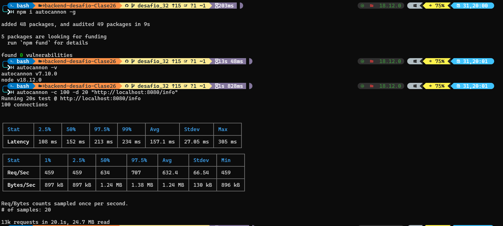

# ⚡ LOGGERS, GZIP y ANÁLISIS DE PERFORMANCE ⚡

## 📚 Clase 32

Retomemos nuestro trabajo para implementar compresión por Gzip, registros por loggueo, y analizar la performance de nuestro servidor.

## 👷🏻‍♀️⚒️ Consigna:

### Incorporar al proyecto de servidor de trabajo la compresión gzip.

Verificar sobre la ruta /info con y sin compresión, la diferencia de cantidad de bytes devueltos en un caso y otro.

Luego implementar loggueo (con alguna librería vista en clase) que registre lo siguiente:

- Ruta y método de todas las peticiones recibidas por el servidor (info)

- Ruta y método de las peticiones a rutas inexistentes en el servidor (warning)
- Errores lanzados por las apis de mensajes y productos, únicamente (error)

Considerar el siguiente criterio:

- Loggear todos los niveles a consola (info, warning y error)

- Registrar sólo los logs de warning a un archivo llamada warn.log

- Enviar sólo los logs de error a un archivo llamada error.log

### Realizar el análisis completo de performance del servidor con el que venimos trabajando.

Vamos a trabajar sobre la ruta '/info', en modo fork, agregando ó extrayendo un console.log de la información colectada antes de devolverla al cliente. Además desactivaremos el child_process de la ruta '/randoms

Para ambas condiciones (con o sin console.log) en la ruta '/info' OBTENER:

1. El perfilamiento del servidor, realizando el test con --prof de node.js. Analizar los resultados obtenidos luego de procesarlos con --prof-process.

Utilizaremos como test de carga Artillery en línea de comandos, emulando 50 conexiones concurrentes con 20 request por cada una. Extraer un reporte con los resultados en archivo de texto.

Luego utilizaremos Autocannon en línea de comandos, emulando 100 conexiones concurrentes realizadas en un tiempo de 20 segundos. Extraer un reporte con los resultados (puede ser un print screen de la consola)

2. El perfilamiento del servidor con el modo inspector de node.js --inspect. Revisar el tiempo de los procesos menos performantes sobre el archivo fuente de inspección.

3. El diagrama de flama con 0x, emulando la carga con Autocannon con los mismos parámetros anteriores.

Realizar un informe en formato pdf sobre las pruebas realizadas incluyendo los resultados de todos los test (texto e imágenes).

Al final incluir la conclusión obtenida a partir del análisis de los datos.

---

## 🔥 Resolucion 🔥

En la carpeta `./loggs` se guardara la info que resulte de los errores y warnings como lo pide el desafio puedes ver el archivo de configuracion en el siguiente [link](src/middlewares/log4js.js)

1. Para este punto correr los siguientes comandos:

```bash
npm run prof

ó

node --prof src/app.js
```

Se generarar un archivo .log con el nombre similar a `isolate-000001F11FCC7AE0-12268-v8`, para poder leerlo debes ejecutar el siguiente comando:

```bash
node --prof-process isolate-000001F11FCC7AE0-12268-v8.log > --prof-process-result.txt
```

El cual nos dara la siguiente información [link](--prof-process-result.txt)

Luego debemos usar [Artillery](<[https://](https://www.artillery.io/)>) 🚀

```bash
npm install -g artillery@latest
```

Luego de instalado debemos probar con los siguientes endpoint:

- GET /info
- GET /info/clg ( este endpoint de prueba contiene el console.log )

Antes de probar debemos tener corriendo el servidor:

```bash
npm start
```

Luego si podremos ejecutar los siguientes comandos para realizar la comparacion

```bash
# sin console.log
artillery quick --count 50 --num 20 http://localhost:8080/info > artillery_results/noclg-result.txt

# con console.log
artillery quick --count 50 --num 20 http://localhost:8080/info/clg > artillery_results/withclg-result.txt
```

Los resultados de la pruebas quedaran guardados en la carpeta `artillery_results`

👨🏻‍💻 Para este ejemplo:

- con console.log --> [withclg-result.txt](artillery_results/withclg-result.txt)
- sin console.log --> [noclg-result.txt](artillery_results/noclg-result.txt)

Por ultimo realizamos las pruebas con [Autocannon](https://www.npmjs.com/package/autocannon) 🚀

```bash
npm i autocannon -g
```

Para utilizar [Autocannon](https://www.npmjs.com/package/autocannon) debemos primero tener corriendo nuestro servidor

```bash
npm start
```

Luego ejecutamos el siguiente comando:

```bash
autocannon -c 100 -d 20 "http://localhost:8080/info"
```

Nos dara el siguiente resultado por consola



1. Para utilizar el `inspect` de node debemos correr el siguiente sript, [Documentacion](https://nodejs.org/en/docs/guides/debugging-getting-started/)

```bash
npm run inspect
```

Luego debemos ir a las DevTools en chrome --> `chrome://inspect`

En profile apretar `start` para empezar a monitoriar

Para comenzar la prueba podemos correr cualquiera de los comandos anteriores de [Autocannon](https://www.npmjs.com/package/autocannon) o [Artillery](<[https://](https://www.artillery.io/)>)

3. Ahora utilizaremos [0x](https://www.npmjs.com/package/0x) 🚀

```bash
npm i -g 0x
```

para comenzar corremos el siguiente script:

```bash
npm run 0x
```

una vez el servidor este corriendo ejecutamos el comando del ejercicio anterior de [Autocannon](https://www.npmjs.com/package/autocannon) o [Artillery](<[https://](https://www.artillery.io/)>)

```
autocannon -c 100 -d 20 "http://localhost:8080/info"
```

Cuando finaliza el comando debemos parar el servidor

en el cual se nos generara una [carpeta](4036.0x/) con la info correspondiente, donde tendremos un archivo html [flamegraph.html](4036.0x/flamegraph.html), es recomendable tener la extencion [live server](https://marketplace.visualstudio.com/items?itemName=ritwickdey.LiveServer)
